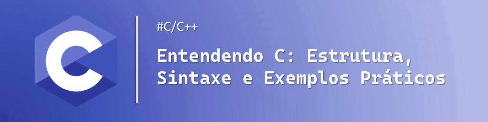

    

  
  

-------

# Projeto artigo técnico gerado por I.A.s

Projeto com o objetivo de gerar um artigo técnico com um layout rico, leitura agradável e com foco em promover sua autoridade técnica.

<a href="https://web.dio.me/articles/entendendo-c-estrutura-sintaxe-e-exemplos-praticos?back=%2Farticles&open-modal=true&page=1&order=oldest> 📕Clique aqui para ler o artigo</a>

## 💻 Tecnologias utilizadas no projeto

- [ChatGPT](https://chat.openai.com/) - para título e conteúdo
- [Lexica.art](https://lexica.art/) - para gerar imagens
- [PowerPoint](https://www.microsoft.com/en/microsoft-365/powerpoint) - Para formatação de banners e Layouts

## 📄 Prompts e ferramentas

ChatGPT：

|   Ação   | prompt                                                                                                                                                                                                                                                                         |
| :------: | ------------------------------------------------------------------------------------------------------------------------------------------------------------------------------------------------------------------------------------------------------------------------------ |
|  título  | Entendendo C: Estrutura, Sintaxe e Exemplos Práticos                                                                                                                                                                                                    |
| conteúdo | Comporte-se como um escritor de artigos tech front-end e escreva um artigo sobre "Comandos em C: Estrutura, Sintaxe e Exemplos Práticos" {REGRAS} No máximo 5 linhas de texto explicativo por bloco de explicação. Escreva de maneira informal, como se fosse para uma pessoa que nunca teve contato com o mundo da programação. Comandos são tanto funções, operadores lógicos, operadores condicionais.Os blocos que serão criados estão abaixo (O que é a linguagem C (e principais usabilidades); O que são os comando; O que são comando C (qual a estrutura geral e a sintaxe básica); Quais são as comandos básicas que todo iniciante em C deveria conhecer; explique e mostre pequenas implementações dessas comandos; Faça um call to action para minhas redes sociais)                                                                                                |

Lexica.art：

- No léxica utilizamos o acervo público de imagens geradas por outras pessoas, os termos de pesquisa que utilizei durante a gravação do conteúdo foram:

• C programming language

## ✨ Features

- Conteúdo gerado via ChatGPT
- Imagens do acervo público geradas via Lexica.art

## 📚 Materiais

- prompts utilizados

## 🛠️ Instruções de execução

Utilize os prompts acima nas ferramentas sugeridas para gerar o material base e utilize uma ferramenta de edição de documentos como power point, libreoffice , indesign para diagramação, o passo a passo em vídeo pode ser conferido na plataforma da [DIO](https://dio.me).
